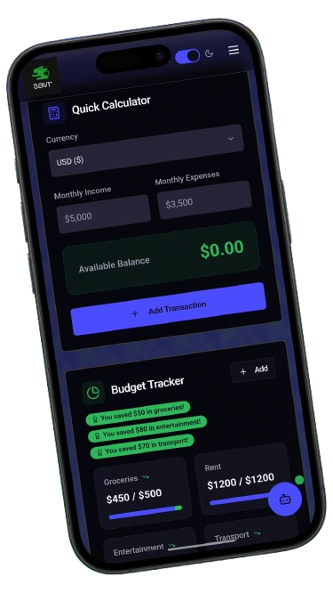

<h1 align="center">
  
  SAVR – AI Personal Finance Assistant
  
</h1>

<p align="center">
  
  
  
</p>

<p align="center">
  
</p>

---

## 🧠 About Savr

**Savr** is a beautifully crafted AI-powered finance assistant built for modern users. Whether you're saving for your next vacation or managing rent and groceries — Savr has your back.

### ✨ Features
- 📊 **Quick Calculator** – Get real-time balance based on your income/expenses.
- 🧠 **AI-Powered Chatbot** – Financial guidance just a prompt away.
- 📅 **Budget Tracker** – Visually track goals like groceries, rent, and more.
- 💻 **Responsive Design** – Seamless experience across all devices.
- 🌑 **Dark Mode Ready** – Because aesthetic > everything.

---

## ⚙️ Built With

- 🛠️ [Bolt.new](https://bolt.new/) – No-code + custom code magic.
- ⚡ Vite – Lightning-fast front-end tooling.
- 🎨 TailwindCSS – For that clean, modern UI.
- 🧱 TypeScript – Type-safe and future-proof.
- 💚 Netlify – One-click deploy heaven.

---

## 🚀 Getting Started

### Clone & Run Locally

```bash
git clone https://github.com/your-username/savr.git
cd savr
npm install
npm run dev
```
## For Running
```bash
npm run build
```
---
## ✨ Live Demo
👉 https://savrfinancetracker.netlify.app
---
<p align="center">  <br /> <b>Manage Money. Master Life. 💸</b> </p> 
